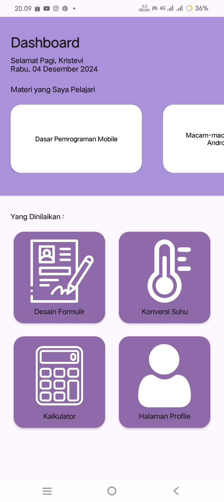

<h1>. ݁ ˖╭ ┆ Aplikasi Mobile Sederhana ╰⊹ ࣪</h1>
<h4>Aplikasi ini berisikan desain formulir, konversi suhu, kalkulator sederhana, dan profil. Dapat digunakan dengan tema Terang dan Gelap.</h4>
<h3>☄ Halaman Dashboard</h3>
<h4>▸ Pada halaman ini menampilkan halaman utama dari aplikasi.</h4>
<h4>──── ⟢ Potrait</h4>
<table>
  <tr align="center">
    <td> Mode Terang</td>
    <td> Mode Gelap</td>
  </tr>
</table>
<h4>──── ⟢ Landscape</h4>
<table>
  <tr align="center">
    <td> Mode Terang</td>
    <td> Mode Gelap</td>
  </tr>
</table>
<h3>☄ Halaman Desain Formulir</h3>
<h4>▸ Pada halaman ini berisikan desain formulir untuk pendaftaran ekstrakurikuler.</h4>
<h4>──── ⟢ Potrait</h4>
<table>
  <tr align="center">
    <td> Mode Terang</td>
    <td> Mode Gelap</td>
  </tr>
</table>
<h4>──── ⟢ Landscape</h4>
<table>
  <tr align="center">
    <td> Mode Terang</td>
    <td> Mode Gelap</td>
  </tr>
</table>
<h3>☄ Halaman Konversi Suhu</h3>
<h4>▸ Pada halaman ini pengguna dapat mengkonversikan suhu Celcius, Fahrenheit, dan Kelvin.</h4>
<h4>──── ⟢ Potrait</h4>
<table>
  <tr align="center">
    <td> Mode Terang</td>
    <td> Mode Gelap</td>
  </tr>
</table>
<h4>──── ⟢ Landscape</h4>
<table>
  <tr align="center">
    <td> Mode Terang</td>
    <td> Mode Gelap</td>
  </tr>
</table>
<h3>☄ Halaman Kalkulator</h3>
<h4>▸ Pada halaman ini pengguna dapat menghitung operasi bilangan yaitu penjumlahan, pengurangan, perkalian, dan pembagian.</h4>
<h4>──── ⟢ Potrait</h4>
<table>
  <tr align="center">
    <td> Mode Terang</td>
    <td> Mode Gelap</td>
  </tr>
</table>
<h4>──── ⟢ Landscape</h4>
<table>
  <tr align="center">
    <td> Mode Terang</td>
    <td> Mode Gelap</td>
  </tr>
</table>
<h3>☄ Halaman Profil</h3>
<h4>▸ Halaman tidak dapat ditampilkan karena berisi informasi pribadi.</h4>
<h1></h1>
